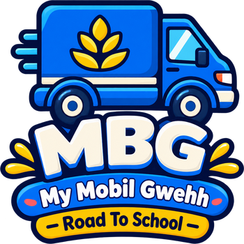

<p align="center">
  
</p>

# MMG: Road To School (My Mobil Gwehh)

<p align="center">
  <strong>Misi Pengantaran 500 Porsi Paket Gizi Hangat & Kisah Asmara di Gerbang Puspa Bangsa</strong><br>
  <em>Game Side-Scrolling 2D Physics Platformer Karya Anak Bangsa</em>
</p>

<p align="center">
  
  
  
  
</p>

---

## Sinopsis & Kisah Dinamika Asmara: Mas Tion & Bu Yulie 🍱❤️

Di balik deru mesin truk Canter yang membelah kerasnya aspal Jalur Arteri Pantura, lumpur sawah perdesaan, hingga tanjakan bebatuan curam lereng Gunung Ciremai, berkobar tekad membara di dada **Mas Tion**. Bagi pemuda pengemudi berjiwa ksatria ini, misinya bukan sekadar menuntaskan 20 etape pengantaran logistik 500 porsi paket gizi hangat tepat waktu, melainkan kerinduan mendalam untuk tiba di gerbang **Sekolah Puspa Bangsa** sebelum bel istirahat berbunyi pukul 09:45 pagi—tepat saat sosok wanita pujaannya berdiri setia menyambut.

Wanita berhati mulia itu adalah **Bu Yulie**, guru muda berdedikasi tinggi nan anggun, penuh empati, dan dicintai seluruh muridnya di SD, SMP, dan SMA Puspa Bangsa Cirebon. Di setiap garis finis, Bu Yulie selalu berdiri menanti kepulan debu truk kuning Mas Tion dengan debar cemas bercampur harap. Bagi Mas Tion, setiap guncangan jalan yang diredam pegas suspensi dan setiap porsi kargo yang tiba dalam kondisi 100% utuh tanpa tumpah adalah wujud nyata ketulusan janji dan baktinya kepada Bu Yulie.

Dinamika asmara keduanya terjalin begitu hangat, manis, dan bersahaja:
* **Momen Tersipu di Gerbang Sekolah**: Sosok Mas Tion yang begitu lincah dan berani bermanuver di jalanan seketika berubah canggung dan tersipu malu setiap kali Bu Yulie menyapanya dengan senyuman tulus, menyeka peluh di keningnya, dan menyuguhkan segelas teh melati hangat.
* **Candaan Hangat di Perjalanan**: Romansa mereka kerap diwarnai celetukan jahil dari **Husna** (siswi ceria berambut kuncir yang hobi menggoda Mas Tion) serta petuah jenaka dari **Mang Abdul**, supir veteran pendamping (*"Gassken Tion, cinta butuh torsi tinggi dan komitmen pantang rem blong!"*).
* **Melodi Romantis Outro**: Setiap kali garis finis terlewati, raungan mesin seketika senyap dan berganti dengan alunan **Backsound Romantis Akustik/Lofi** (*Cmaj7 – Am9 – Fmaj7 – G6*) yang mengiringi percakapan penuh kasih antara Mas Tion dan Bu Yulie di bawah teduhnya gerbang sekolah, mengalun lembut hingga ke Kartu Kemenangan.

---

## Fitur Unggulan

1. **Kampanye 20 Level Penuh Cerita**:
   - Peningkatan jarak lintasan bertahap dari 800 meter (Level 1) hingga 4500 meter (Level 20).
   - Dialog bergaya Visual Novel (Intro & Outro) di setiap level bersama Mas Tion, Bu Yulie, Zacky, Husna, Mang Abdul, dan Pak RT.
2. **Garasi Zacky (Sistem Modifikasi & Ekonomi Dua Tahap Ketat)**:
   - **Upgrade Komponen**: Tingkatkan Mesin (torsi & tanjakan), Ban (grip aspal/lumpur), dan Suspensi (redaman kejut) dari Level 1 hingga 20.
   - **Kustomisasi Kosmetik**: 5 varian bodi (*Standard Box, Speedy Courier, Mountain 4x4, Retro Classic, Sport Tuned*) dan 5 desain velg (*Stock Steel, Gold Alloy, Mud Beadlock, White-Wall, Offroad Spoke*).
   - **Aturan Ekonomi Ketat**: Buka Level $\to$ Beli dengan Koin Gizi $\to$ Pasang Gratis Selamanya.
   - **Offroad Stance Proporsional**: Bodi dan ban tidak gepeng, diselaraskan presisi dengan bayangan realistis di lantai bengkel garasi.
3. **8 Bioma Menawan & Parallax Scrolling**:
   - Pesisir Pantai Pantura, Arteri Pantura, Lembah Sawah, Pedesaan Lumbung Padi, Siluet Gn. Ciremai, Hutan Pinus Terjal, Pemukiman Suburb, hingga Gerbang Kompleks Sekolah Puspa Bangsa.
   - Transisi visual mulus 200m dengan dynamic RGBA skybox lerping.
4. **Antarmuka Elegan "Floating Translucent Aero-Glass"**:
   - Seluruh 9 modal UI (Welcome Page, Main Menu, Pemilihan Level, Garasi Zacky, Pause, Game Over, Dialog Intro/Outro, dan Kartu Kemenangan) menggunakan estetika frosted glass (`backdrop-blur-xl`, `border-white/20`, neon glow) yang tidak menutupi keindahan ilustrasi latar belakang.
   - Kontrol pedal sentuh **Glassmorphic Cyber-Chic** dengan haptic grip dots.
   - Tampilan bersih kristal tanpa efek scanlines yang mengaburkan visual.
5. **Sistem Audio WebAudio Canggih**:
   - Pemadaman seketika audio kendaraan saat menyentuh garis finis (*zero-leakage guarantee*).
   - Sekuensing Fanfare Kemenangan disusul alunan tema romantis balada lofi beresolusi filter 3400Hz dan resonansi chorus ganda.
6. **Ekonomi Koin Permanen**:
   - Koin gizi yang dikumpulkan di lintasan otomatis tersimpan permanen di `localStorage`, bahkan jika kendaraan kehabisan bensin atau terguling.

---

## Kesiapan Vercel & Mobile Landscape Native 📱💻

Proyek ini dirancang agar dapat langsung di-deploy ke **Vercel** dan dimainkan secara optimal baik di layar komputer maupun smartphone:

* **Arsitektur Vercel (Next.js 16 + Pure Canvas Hub)**:
  - Routing root `/` otomatis di-*rewrite* ke `/index.html` via `next.config.js`.
  - Otomatisasi sinkronisasi `prebuild: node scripts/sync_html.js` memastikan `public/index.html` selalu sinkron 1:1 saat proses `next build` dieksekusi di server Vercel.
  - Seluruh API Next.js (`/api/levels`, `/api/story`, `/api/upgrades`) tetap aktif berjalan normal.
* **Mobile Landscape Enforcer**:
  - Dikelola melalui PWA Webmanifest (`public/app.webmanifest`) dengan aturan `"orientation": "landscape"` dan `"display": "fullscreen"`.
  - Jika pemain membuka game di ponsel dalam posisi vertikal (potret), layar dilindungi overlay ramah `#rotateDeviceOverlay` yang memandu pemain untuk memutar ponsel ke horizontal.
  - Dilengkapi tombol satu sentuhan *"MASUK LAYAR PENUH (FULLSCREEN)"* dengan `screen.orientation.lock('landscape')`.
  - **Auto-Pause Protection**: Game otomatis menjeda jalannya waktu dan konsumsi bensin jika ponsel tidak sengaja terputar vertikal saat berkendara.
* **Favicon & Icon Resmi MMG**:
  - Favicon multi-resolusi (32x32, 192x192, 350x350) terpasang di browser tab, berkas `favicon.ico` 32-bit, `apple-touch-icon.png`, dan file metadata Next.js `app/icon.png`.

---

## Cara Menjalankan

### Opsi A: Mode Fullstack Next.js / React (Rekomendasi)
Memerlukan Node.js (v18+). Dari root direktori proyek (`c:\Projects\game`):
```bash
# Instal dependensi (jika baru pertama kali clone)
npm install

# Jalankan server pengembangan
npm run dev
```
Akses di browser: [http://localhost:3000](http://localhost:3000)

Untuk build produksi lokal:
```bash
npm run build
npm start
```

### Opsi B: Mode Standalone HTML5 Canvas (Tanpa Build)
Dapat disajikan langsung melalui web server statis:
```bash
# Menggunakan Python
python -m http.server 8000

# Atau menggunakan PHP
php -S localhost:8000
```
Buka browser di: [http://localhost:8000](http://localhost:8000)

> [!NOTE]
> Gunakan protokol HTTP (`http://`), hindari membuka berkas langsung via `file://` agar browser dapat mengeksekusi modul ES (`game_core.js`) dan memuat `manifest.json`.

---

## Kontrol Permainan

| Aksi | Keyboard (Desktop) | Sentuh (Mobile / Tablet) |
| :--- | :--- | :--- |
| **Gas / Akselerasi** | `D`, `W`, `Panah Kanan`, `Panah Atas` | Pedal Kanan (**GAS**) |
| **Rem / Mundur** | `A`, `S`, `Panah Kiri`, `Panah Bawah` | Pedal Kiri (**REM**) |
| **Klakson Telolet** | `H` atau `Spasi` | Tombol Tengah (**TELOLET**) |
| **Jeda (Pause)** | `Esc` | Tombol Jeda di HUD |
| **Mulai Ulang (Restart)** | `R` | Tombol Ulangi di Layar Selesai |

* **Manuver Akrobatik Udara (Airborne & Stunts)**:
  - Tahan `Gas` di udara untuk menaikkan hidung mobil (*pitch up*) atau tahan `Rem` untuk menurunkan hidung (*pitch down*).
  - Tampil lencana neon real-time di atas kendaraan saat melayang (`AIR TIME X.Xs ✈️`), mengangkat roda depan (`WHEELIE X.Xs ⚡`), atau menungging di roda depan (`STOPPIE X.Xs 🛑`).
  - Pendaratan yang mulus setelah atraksi akrobatik menghadiahkan bonus koin gizi instan (+5 s.d. +30 koin).

---

## Pengujian & Verifikasi

Seluruh komponen fisika kendaraan, logika kampanye, arsitektur UI, dan sintesis audio diuji dengan test runner Node.js bawaan:
```bash
npm test
```
**Hasil Aktual**: **96/96 Unit Test Lulus (100% PASS, 0 Gagal)**.
* Validasi stabilitas dan ground clearance awal seluruh 20 bioma level (y=520 pada x=150px).
* Simulasi dinamis suspensi, weight transfer, dan landing shock absorption.
* Integritas seluruh DOM ID dan elemen interaktif antarmuka aero-glass.
* Konsistensi aset visual karakter, skin, velg, serta kelengkapan dialog visual novel.
* Kompilasi produksi Next.js 16 (`npm run build`) berhasil 100% tanpa error.

---

## Dokumentasi Teknis

* [PRD (Product Requirement Document)](docs/PRD.md)
* [Arsitektur Teknis](docs/ARCHITECTURE.md)
* [Panduan Gameplay](docs/GAMEPLAY.md)
* [Panduan Aset & Manifest](docs/ASSETS_GUIDE.md)
* [Prompt AI Higgsfield Karakter & Skin](docs/CHARACTERS_AND_SKINS_PROMPTS.md)
* [Strategi & Hasil Testing](docs/TESTING.md)
* [Panduan Deployment](docs/DEPLOYMENT.md)
* [Log Implementasi](docs/IMPLEMENTATION_LOG.md)
* [Catatan Maintainer (Memory)](docs/memory.md)
