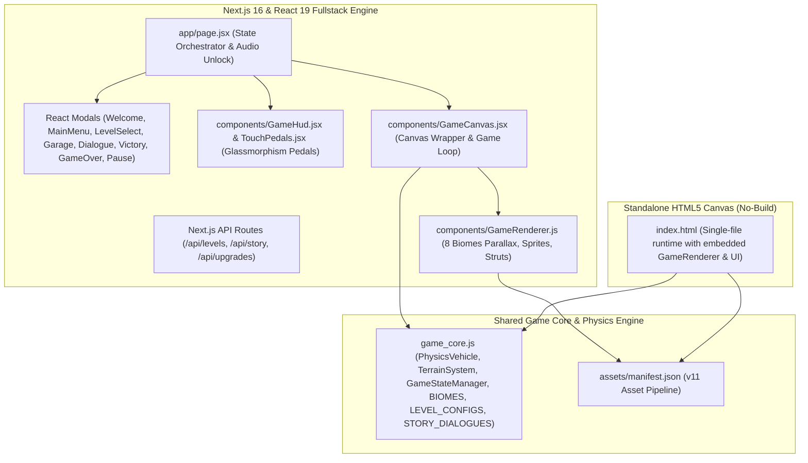

# Arsitektur Teknis — MBG: Road To School

Dokumen ini mendefinisikan arsitektur teknis lengkap game *MBG: Road To School*. Jika terdapat perbedaan dengan kode implementasi, kode aktif pada `game_core.js`, `components/`, dan test suite menjadi acuan utama.

---

## 1. Ikhtisar Arsitektur Dual-Stack

Sistem mengadopsi arsitektur dual-stack yang fleksibel:

### Keunggulan Arsitektur:
1. **Next.js 16 + React 19**: Pengalaman UI modular yang responsif, visual dialog novel yang interaktif, live truck preview pada bengkel modifikasi, dan kontrol glassmorphism modern.
2. **Standalone HTML5 Canvas**: Kemudahan instan untuk pengujian cepat tanpa dependensi server atau build pipeline.
3. **Single Source of Truth**: Logika fisika, perhitungan terrain, dan state game berada di `game_core.js` sehingga identik di browser, React, dan automated unit tests.

---

## 2. Penskalaan Fisika & Formula Garasi Zacky

Unit dalam fisika kendaraan adalah nilai tuning arcade terkalkulasi (bukan SI murni).

| Parameter Baseline (Level 1) | Nilai Baseline | Penskalaan Upgrade per Level (s.d. Lv 20) | Efek Gameplay |
| :--- | :--- | :--- | :--- |
| **Daya Mesin (*Engine Power*)** | `2200` | $+80$ per level (Maks `3720`) | Torsi menanjak di lereng curam, akselerasi |
| **Cengkeraman Ban (*Tire Grip*)** | `1.00x` | $+0.03x$ per level (Maks `1.57x`) | Traksi di aspal basah & lumpur sawah |
| **Pegas Suspensi (*Spring $K$*)** | `180` | $+4$ per level (Maks `256`) | Daya topang beban dan redaman benturan |
| **Redaman Suspensi (*Damper $C$*)** | `18.8` | $+0.4$ per level (Maks `26.4`) | Meredam pantulan agar sayur lodeh tidak tumpah |
| **Gravitasi (*Gravity*)** | `980 px/s²` | Tetap | Gaya gravitasi bumi ke bawah |
| **Massa Kendaraan (*Mass*)** | `1400` | Tetap | Massa inersia sasis truk |
| **Batas Laju Maju / Mundur** | `550 / 220 px/s` | Tetap | $550\text{ px/s} \approx 99\text{ km/h}$ pada HUD |
| **Torsi Pitch Tanah (Gas/Rem)** | `260 / 120` | Tetap | Menghasilkan wheelie terkendali / stoppie |
| **Torsi Pitch Udara** | `4.0 rad/s²` | Tetap | Kontrol pendaratan miring di udara |
| **Batas Rollover** | $> 105^\circ$ (1.83 rad) | 0.45 detik grace period | Deteksi mobil terbalik / gagal |

### Formula Biaya Upgrade Komponen:
$$\text{Cost}(\text{level}) = \text{round}\left(50 \times 1.35^{\text{level} - 1}\right)$$

---

## 3. Sistem 8 Bioma Dedikasi & Parallax Rendering

Game memiliki 8 bioma berurutan, masing-masing terhubung langsung ke aset ilustrasi latar belakang dan transisi 200m yang mulus:

```mermaid
flowchart LR
    B1["1. Pesisir Pantai Pantura (0 - 600m)"] --> B2["2. Jalur Arteri Pantura (600 - 1200m)"]
    B2 --> B3["3. Hamparan Lembah Sawah (1200 - 2000m)"]
    B3 --> B4["4. Pedesaan Lumbung Padi (2000 - 2800m)"]
    B4 --> B5["5. Puncak Siluet Gn. Ciremai (2800 - 3500m)"]
    B5 --> B6["6. Lereng Hutan Pinus Terjal (3500 - 4200m)"]
    B6 --> B7["7. Kawasan Pemukiman Suburb (4200 - 4400m)"]
    B7 --> B8["8. Kompleks Sekolah Puspa Bangsa (4400 - 4600m)"]
```

### Algoritma Blending 200m & RGBA Skybox Lerp:
Pada zona transisi 200m di antara dua bioma:
- **Skybox Lerp**: Warna gradient langit diinterpolasi secara linear menggunakan formula RGBA lerp antara palet langit bioma sebelumnya dan berikutnya.
- **Parallax Cross-Fade**: Layer latar jauh dan latar tengah di-*cross-fade* menggunakan transparansi alpha bertingkat ($\alpha_1 = 1 - t$, $\alpha_2 = t$).
- **Material Jalan**: Tekstur permukaan tanah (aspal, pematang licin, bebatuan gunung) bertransisi secara mulus tanpa diskontinuitas visual.

---

## 4. Pipeline Aset Manifest (v11)

Manifest runtime dimuat dari [`assets/manifest.json`](file:///c:/Projects/game/assets/manifest.json):
- **Sprites**:
  - `truckBody`: [`assets/refresh/v11/sprites/truck_body.png`](file:///c:/Projects/game/assets/refresh/v11/sprites/truck_body.png)
  - `truckWheel`: [`assets/refresh/v11/sprites/truck_wheel.png`](file:///c:/Projects/game/assets/refresh/v11/sprites/truck_wheel.png)
  - `fuelCan`: [`assets/refresh/v11/sprites/fuel_can.png`](file:///c:/Projects/game/assets/refresh/v11/sprites/fuel_can.png)
  - `coinGizi`: [`assets/refresh/v11/sprites/coin_gizi.png`](file:///c:/Projects/game/assets/refresh/v11/sprites/coin_gizi.png)
  - `obstacleLog`: [`assets/refresh/v11/sprites/obstacle_log.png`](file:///c:/Projects/game/assets/refresh/v11/sprites/obstacle_log.png)
  - `finishGate`: [`assets/refresh/v11/sprites/finish_gate.png`](file:///c:/Projects/game/assets/refresh/v11/sprites/finish_gate.png)
  - `foodParcel`: [`assets/refresh/v11/sprites/food_parcel.png`](file:///c:/Projects/game/assets/refresh/v11/sprites/food_parcel.png)
  - `gameLogo`: [`assets/refresh/v11/sprites/logo.png`](file:///c:/Projects/game/assets/refresh/v11/sprites/logo.png)
- **Backgrounds (8 Bioma)**:
  - `biome1Distant` & `biome1Midground` (Pantura)
  - `biome2Distant` & `biome2Midground` (Sawah)
  - `biome3Distant` & `biome3Midground` (Gunung)
  - `biome4Distant` & `biome4Midground` (Pemukiman & Sekolah)

---

## 5. Mitigasi Risiko & Keandalan

| Potensi Risiko | Mekanisme Mitigasi Otomatis |
| :--- | :--- |
| **Gagal muat aset gambar** | Loader manifest mengeksekusi primary path, fallback path, dan prosedur procedural canvas jika gambar gagal ter-decode. |
| **Regresi fisika gameplay** | Suite 80 unit test otomatis memvalidasi konstanta, daya mesin, suspensi, pendaratan miring, dan simulasi 20 level. |
| **Inkonsistensi narasi** | Test suite memvalidasi teks lore kanonik (Mas Tion supir utama, Bu Yulie, Mang Abdul supir senior/mentor). |
| **Cache browser lama** | Query modul `?v=...`, header cache Vercel, dan static bundle Next.js dengan hash unik pada setiap build. |
